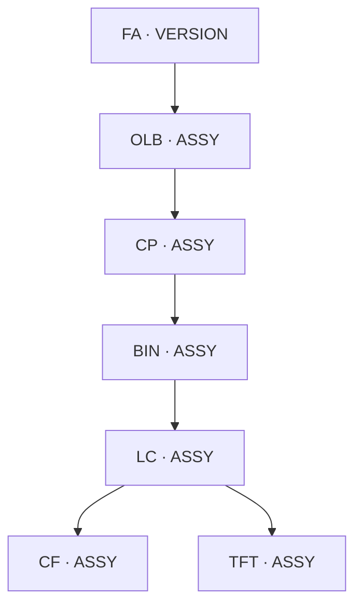
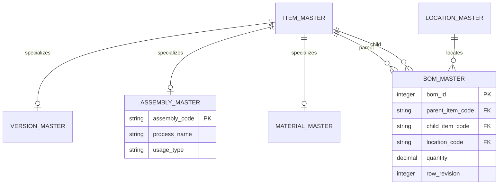

# Display BOM AI Agent v2.0

## STEP24-A1 v2 — SQLite Domain 및 Repository 상세 설계

- 기준선: `v1.0.0`, 기존 자동화 테스트 `251 passed`
- 작업 브랜치: `feature/phase2-sqlite`
- 문서 상태: 업무 구조 재정의 반영본
- 적용 범위: 설계 확정만 수행하며 Runtime 코드는 아직 변경하지 않는다.
- 대체 관계: 기존 STEP24-A1 및 이를 바탕으로 만든 A2/B1 초안은 이 문서로 대체한다.

---

## 1. 설계 목표와 구조

```text
LangGraph Agent
  → MCP Client / Server
  → Service / Rule Engine
  → Repository Protocol
      ├─ CSV Adapter      (비교·복구용)
      └─ SQLite Adapter   (신규 Runtime)
          → Unit of Work / Transaction
```

1. FA(`VERSION_CODE`)를 BOM의 최상위 기준으로 사용한다.
2. MODEL/MOD 및 `MODEL_MASTER`는 v2 기준정보에서 제거한다.
3. BOM에는 직접 `PARENT–CHILD` 관계만 저장한다.
4. 이름과 상세정보는 Master에서 관리하고 BOM 행에는 중복 저장하지 않는다.
5. DB별 계층 조회 차이는 Repository가 감춘다.
6. Production BOM 변경은 하나의 트랜잭션으로 보호한다.
7. CSV Runtime은 데이터 동등성 검증이 끝날 때까지 유지한다.
8. LLM은 요청을 해석하고, 구조 규칙과 변경 가능 여부는 Service/Rule Engine이 결정한다.

---

## 2. 확정 BOM 업무 구조



- FA는 생산코드이자 BOM 조회의 Root이다.
- OLB, CP, BIN, LC, CF, TFT는 중간 Assembly이다.
- CF와 TFT는 동일 레벨이며 모두 LC의 직접 Child이다.
- 일반 Material은 FA 및 모든 Assembly의 Child가 될 수 있다.
- Material은 Parent가 될 수 없다.

### 허용 관계

| Parent | 허용 Child |
|---|---|
| FA | OLB, MATERIAL |
| OLB | CP, MATERIAL |
| CP | BIN, MATERIAL |
| BIN | LC, MATERIAL |
| LC | CF, TFT, MATERIAL |
| CF | MATERIAL |
| TFT | MATERIAL |
| MATERIAL | 없음 |

허용되지 않은 관계, 자기참조, 순환 구조는 Service에서 등록 전에 차단하고 DB 제약조건이 기본 무결성을 보조한다.

### Assembly 공용/단독 속성

활성 BOM에서 해당 Assembly를 직접 Child로 사용하는 서로 다른 Parent 수를 기준으로 판정한다.

| `usage_type` | 판정 기준 |
|---|---|
| `DEDICATED` | 활성 직접 Parent 1개 |
| `COMMON` | 활성 직접 Parent 2개 이상 |

연결이 없는 신규 Assembly는 초기값 `DEDICATED`를 허용하되 최초 연결 때 확정한다. BOM 변경 트랜잭션 안에서 영향받은 Assembly의 값을 재계산하거나 검증한다.

---

## 3. 기준정보 모델

### `item_master` — 공통 품목 Registry

BOM의 Parent와 Child가 서로 다른 Master에 존재해도 하나의 FK로 참조할 수 있게 한다.

| 컬럼 | 의미 |
|---|---|
| `item_code` PK | VERSION/ASSEMBLY/MATERIAL 공통 코드 |
| `item_type` | `VERSION`, `ASSEMBLY`, `MATERIAL` |
| `item_name` | 표준 명칭 |
| `description` | 상세 규격·설명 |
| `active_yn` | 사용 여부 |
| `created_at`, `updated_at` | 감사 시각 |

`item_name`에는 모델명이나 Parent 문맥을 넣지 않는다.

### `version_master`

| 컬럼 | 의미 |
|---|---|
| `version_code` PK/FK | `item_master.item_code`와 1:1 |
| `version_no` | 01, 02, 03 등의 버전 번호 |
| `route_code` | 생산 Route 식별자 |
| `specification` | 기존 제품 기본사양을 통합할 확장 영역 |
| `customer_code` FK | 고객 기준정보, 선택값 |
| `active_yn` | 사용 여부 |

별도의 `MODEL_MASTER`와 MOD 품목은 만들지 않는다.

### `assembly_master`

| 컬럼 | 의미 |
|---|---|
| `assembly_code` PK/FK | `item_master.item_code`와 1:1 |
| `process_name` | `OLB`, `CP`, `BIN`, `LC`, `CF`, `TFT` |
| `usage_type` | `COMMON`, `DEDICATED` |
| `specification` | Assembly 상세 규격 |
| `active_yn` | 사용 여부 |

### `material_master`

| 컬럼 | 의미 |
|---|---|
| `material_code` PK/FK | `item_master.item_code`와 1:1 |
| `material_name` | 표준 자재명 |
| `material_group` | 자재 분류 |
| `unit` | 기본 단위 |
| `supplier_code` FK | 기본 공급업체, 선택값 |
| `specification` | 상세 규격 |
| `active_yn` | 사용 여부 |

표준명 예시는 `GLASS`, `DRIVE-IC`, `GATE-IC`, `SEALANT`, `FILM`, `TOUCH-PANEL`, `POL-CF`, `POL-TFT`, `POLARIZE-TOP`, `POLARIZE-BOTTOM`, `RESISTOR`, `TRANSISTOR`이다.

### 보조 기준정보

| 테이블 | 목적 |
|---|---|
| `location_master` | BOM 관계 위치 표준화 |
| `supplier_master`, `customer_master` | 업체·고객 기준정보 |
| `material_attributes` | 가변 자재 속성 |
| `material_compatibility` | 자재 호환 규칙 |
| `design_rules` | 설계변경 검증 규칙 |
| `review_checklists` | 품평 검사항목 |
| `bom_hierarchy_rules` | 허용 Parent–Child 규칙 |
| `query_aliases` | 자연어 질의 Alias |

---

## 4. `bom_master` 상세 설계

| 컬럼 | 제약/의미 |
|---|---|
| `bom_id` | 내부 PK, 자동 생성; 일반 화면·보고서·MCP 응답에서 숨김 |
| `parent_item_code` | `item_master.item_code` FK |
| `child_item_code` | `item_master.item_code` FK |
| `location_code` | `location_master.location_code` FK |
| `sequence_no` | 동일 Parent 화면 정렬 순서 |
| `quantity` | 0보다 큰 소요량 |
| `valid_from`, `valid_to` | 유효기간; 종료일 NULL 허용 |
| `row_revision` | Optimistic Lock용 Revision, 1 이상 |
| `status` | `DRAFT`, `ACTIVE`, `INACTIVE` |
| `created_at`, `updated_at` | 감사 시각 |

저장하지 않는 컬럼:

- `root_version_code`: 계층 조회로 계산한다.
- `parent_name`, `child_name`: Master JOIN으로 조회한다.
- 모델명 또는 Parent 문맥이 포함된 가공 명칭

### 핵심 제약조건과 Index

```text
PRIMARY KEY (bom_id)
FOREIGN KEY (parent_item_code) REFERENCES item_master(item_code)
FOREIGN KEY (child_item_code)  REFERENCES item_master(item_code)
FOREIGN KEY (location_code)    REFERENCES location_master(location_code)
CHECK (parent_item_code <> child_item_code)
CHECK (quantity > 0)
CHECK (row_revision >= 1)
CHECK (valid_to IS NULL OR valid_to >= valid_from)
UNIQUE (parent_item_code, child_item_code, location_code, valid_from)
```

- Index `(parent_item_code, status, valid_from, valid_to)`
- Index `(child_item_code, status, valid_from, valid_to)`
- Index `(parent_item_code, sequence_no)`

같은 Parent 아래 같은 자재가 같은 Location에 중복되면 별도 행을 만들지 않고 `quantity`로 합산한다.

### Location

Location은 자재 자체가 아니라 BOM 관계의 속성이므로 `bom_master.location_code`에 둔다.

| DB 코드 | 화면 표시 |
|---|---|
| `N/A` | 해당 없음 |
| `ALL` | 전체 |
| `TOP`, `BOTTOM` | 상단, 하단 |
| `LEFT`, `RIGHT` | 좌측, 우측 |
| `TOP_LEFT`, `TOP_RIGHT` | 좌측 상단, 우측 상단 |
| `BOTTOM_LEFT`, `BOTTOM_RIGHT` | 좌측 하단, 우측 하단 |
| `CENTER` | 중앙 |

- Assembly 간 관계는 기본적으로 `N/A`를 사용한다.
- 동일 Assembly 아래 같은 Screw/Film 코드라도 Location이 다르면 별도 행을 허용한다.
- `location_master`: `location_code`, `location_name`, `sort_order`, `active_yn`.

### 일반 화면 예시

| PARENT_CODE | PARENT_NAME | CHILD_CODE | CHILD_NAME | LOCATION | QTY |
|---|---|---|---|---|---:|
| `FA10000001` | FA | `OLB20001` | OLB | N/A | 1 |
| `OLB20001` | OLB | `MAT10001` | FILM | TOP | 1 |
| `OLB20001` | OLB | `MAT10001` | FILM | BOTTOM | 1 |
| `LC500001` | LC | `CF600001` | CF | N/A | 1 |
| `LC500001` | LC | `TFT70001` | TFT | N/A | 1 |

`bom_id`는 표시하지 않는다.

---

## 5. 계층 조회와 순환 방지

Repository의 `get_bom_tree(version_code, as_of_date)`가 DB별 SQL 차이를 감춘다.

| DB | 구현 |
|---|---|
| SQLite | `WITH RECURSIVE` |
| Oracle | `START WITH ... CONNECT BY` |

조회 시작점은 `version_code`이며 결과의 `level`, `path`, 이름과 유형은 계산/JOIN하여 반환한다.

1. 새 관계 추가 전에 Child 하위에 Parent가 이미 존재하는지 검사한다.
2. 재귀 조회에서도 방문 Path를 검사해 비정상 데이터의 무한 전개를 막는다.

---

## 6. 기능별 Transaction 모델

| 영역 | 주요 테이블 |
|---|---|
| 설계변경 | `design_changes`, `design_change_items`, `design_change_checks`, `design_change_snapshots`, `design_change_snapshot_items` |
| 품평 | `review_boms`, `review_bom_revisions`, `review_bom_items`, `bom_reviews`, `bom_review_checks` |
| 적용·감사 | `production_apply_history`, `workflow_events`, `legacy_change_history` |

- 품평 Revision은 발행 후 불변이며 수정은 새 Revision으로 만든다.
- `workflow_events`는 Append-only 업무 Event이며 LangGraph Checkpoint/Conversation Memory와 분리한다.
- v1 CSV 이력은 `legacy_change_history`에 보존한다.

### Production Apply

```text
BEGIN IMMEDIATE
  1. 설계변경 상태 및 승인 확인
  2. 대상 BOM row_revision 확인
  3. 구조·호환·위치·유효기간 규칙 재검증
  4. 변경 전 Snapshot 기록
  5. bom_master INSERT/UPDATE/INACTIVE
  6. 영향받은 Assembly usage_type 재계산
  7. production_apply_history 및 workflow_events 기록
  8. 설계변경 상태 갱신
COMMIT
```

어느 단계든 실패하면 전체를 `ROLLBACK`한다. Repository가 개별 Commit하지 않고 `UnitOfWork`의 Connection/Transaction을 공유한다.

---

## 7. Repository 경계

```python
class VersionRepository(Protocol):
    def get(self, version_code: str): ...
    def search(self, query: str): ...

class ItemRepository(Protocol):
    def get(self, item_code: str): ...
    def find_by_name(self, item_name: str): ...

class AssemblyRepository(Protocol):
    def get(self, assembly_code: str): ...
    def refresh_usage_type(self, assembly_code: str): ...

class BomRepository(Protocol):
    def get_children(self, parent_code: str, as_of_date=None): ...
    def get_parents(self, child_code: str, as_of_date=None): ...
    def get_tree(self, version_code: str, as_of_date=None): ...
    def would_create_cycle(self, parent_code: str, child_code: str): ...
    def add_relation(self, relation, expected_revision=None): ...
    def update_relation(self, relation, expected_revision: int): ...

class UnitOfWork(Protocol):
    versions: VersionRepository
    items: ItemRepository
    assemblies: AssemblyRepository
    boms: BomRepository
    def commit(self): ...
    def rollback(self): ...
```

구현체는 기존 비교용 `Csv*Repository`, 신규 `Sqlite*Repository`, 향후 `Oracle*Repository`로 나눈다. Service DTO는 내부 `bom_id`에 의존하지 않는다.

---

## 8. 기존 CSV의 v2 이관 규칙

현재 CSV의 `MODEL → MOD/product → FA`와 `CF → TFT` 구조를 단순 복사하지 않는다.

| 현재 데이터 | v2 처리 |
|---|---|
| `MODEL` 가상 Root | 제거 |
| MOD/product BOM 행 | 제거 |
| `materials.csv`의 FA | `item_master` + `version_master` |
| `products.csv` 기본사양 | 연결된 FA의 Version 규격으로 병합 |
| OLB, CP, BIN, LC, CF, TFT | `item_master` + `assembly_master` |
| 나머지 일반 품목 | `item_master` + `material_master` |
| 기존 `CF → TFT` | `LC → CF`, `LC → TFT` 형제 관계로 변환 |
| 기존 업무 이력 | 기능별 Transaction 및 Legacy 이력으로 보존 |

이관 Report에는 Master별 성공/실패/중복, 제거한 가상 관계, CF/TFT 변환, 고아 품목, 잘못된 공정 순서, 순환, FA별 전개 비교 결과를 포함한다.

---

## 9. 논리 ERD



---

## 10. 구현 순서와 판정

| 단계 | 작업 | 완료 판단 |
|---|---|---|
| STEP24-A1 v2 | 본 설계 확정 | 사용자 확인 `1` |
| STEP24-A2 v2 | SQLite DDL, 초기화기, Schema 테스트 | 전체 회귀 + 신규 테스트 정상 |
| STEP24-B1 v2 | CSV 변환·이관기 및 검증 Report | 이관·계층 비교 정상 |
| STEP24-C | Repository Protocol 및 SQLite 구현 | CSV/SQLite 계약 테스트 정상 |
| STEP24-D | 조회 Service 단계 전환 | 기존 응답 계약 및 251개 회귀 유지 |
| STEP24-E | Production Apply Transaction 전환 | Rollback·동시성 테스트 정상 |
| STEP24-F | SQLite 화면 조회 지원과 운영 전환 판단 | 사용자 화면 검증 정상 |

- `1`: 정상, 다음 단계 진행
- `0`: 문제 발생, 로그를 바탕으로 수정

현재 실행 환경에서 별도의 pytest 설치나 가상환경 구성은 하지 않는다. 필요한 경우 표준 Python/SQLite 수준의 최소 검증만 하고 전체 테스트는 사용자의 기존 프로젝트 환경에서 실행한다.

---

## 11. A2 v2 착수 전 확정사항

1. FA가 최상위 Root이며 MODEL/MOD Master는 없다.
2. CF와 TFT는 LC의 형제 Child이다.
3. 일반 Material은 FA와 모든 Assembly 아래 연결할 수 있다.
4. `bom_id`는 내부 전용이며 화면에 표시하지 않는다.
5. `root_version_code`는 저장하지 않는다.
6. 동일 Parent·Child는 Location으로 구분한다.
7. COMMON/DEDICATED는 활성 직접 Parent 수로 판정한다.
8. Production BOM 변경은 트랜잭션·Revision·감사 이력으로 보호한다.
9. 기존 A2 Schema와 B1 이관 초안은 재사용하지 않고 A2 v2부터 다시 작성한다.

본 문서 승인 후 첫 코드 변경은 **STEP24-A2 v2: Schema DDL 및 DB 초기화 기반 재작성**이다.
