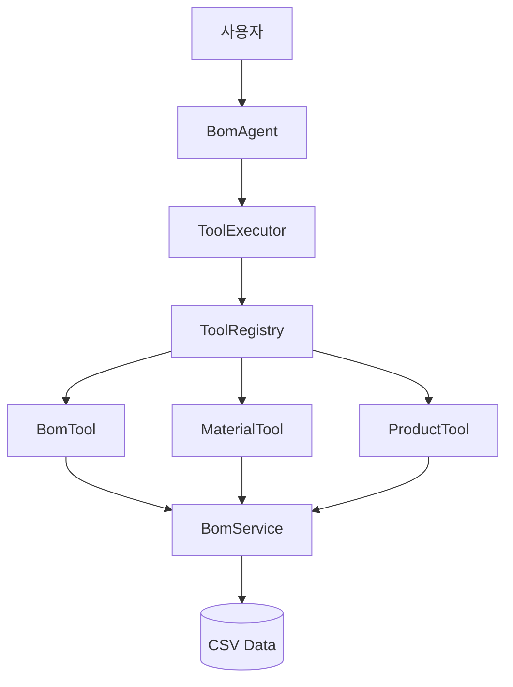
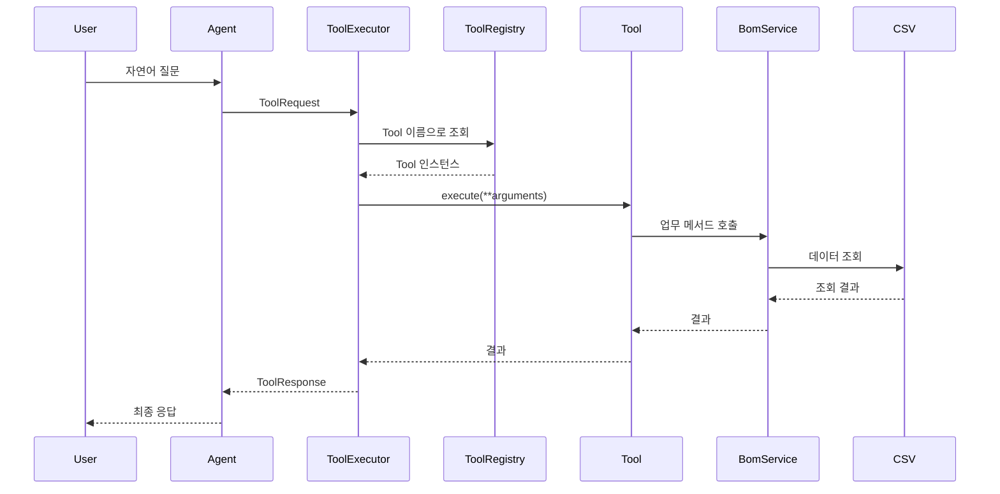

# 시스템 아키텍처

## 전체 구조

## 계층별 책임

### Agent Layer
사용자 입력을 분석하고 어떤 Tool을 실행할지 결정한다. 현재는 미구현이며 다음 단계에서 Rule-based Agent를 구현한다.

### Tool Layer
Agent가 업무 기능을 호출할 수 있도록 표준 인터페이스를 제공한다. Tool은 비즈니스 로직을 직접 구현하지 않고 Service에 위임한다.

### Service Layer
BOM, 자재, 제품 데이터를 조회하는 업무 로직을 수행한다. 현재는 CSV 기반이며 이후 Oracle Repository로 교체할 수 있다.

### Data Layer
합성 CSV 데이터를 저장한다.

## 요청 처리 흐름

## 향후 확장 Tool

- `WhereUsedTool`
- `CompareBomTool`
- `ImpactAnalysisTool`
- `ValidationTool`
- `EngineeringChangeTool`
