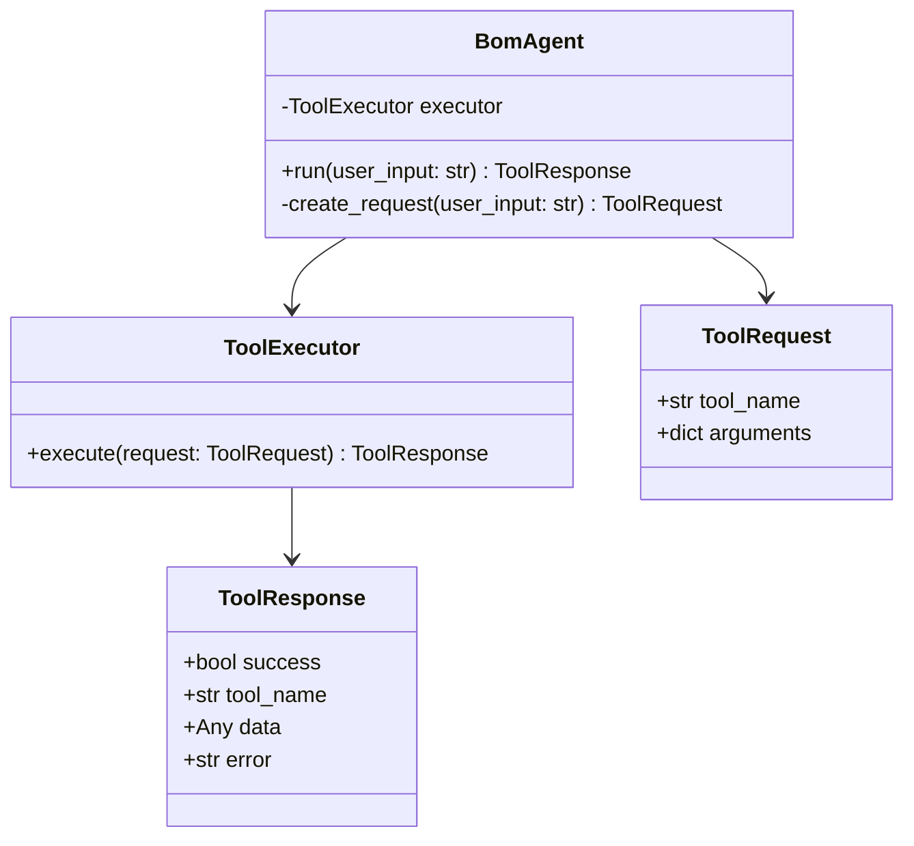

# 다음 단계: Rule-based BomAgent

## 목표

사용자 문장을 분석해 적절한 `ToolRequest`를 만들고 `ToolExecutor`를 실행한다.

## 초기 지원 질문

### BOM 조회

```text
OLED55-A100 BOM 보여줘
OLED55-A100의 구성 자재를 알려줘
```

Tool: `get_bom`

### 자재 검색

```text
Panel 자재를 검색해줘
MAT-001을 찾아줘
```

Tool: `search_material`

### 제품 검색

```text
OLED 제품을 검색해줘
OLED55-A100 제품 정보를 보여줘
```

Tool: `search_product`

## 예정 구조



## 초기 분류 규칙 예시

```text
"BOM" 포함          → get_bom
"자재", "material"  → search_material
"제품", "product"   → search_product
```

## 테스트 예정

```text
tests/test_bom_agent.py
```

검증 항목:

- BOM 질문 분류
- 자재 질문 분류
- 제품 질문 분류
- 지원하지 않는 질문 처리
- Tool 실행 실패 처리
- 공백 입력 처리
